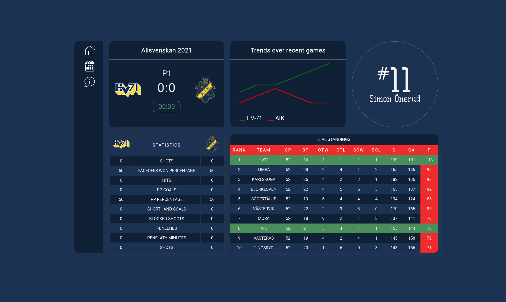

# Getting to know CSS in depth

I have to confess that CSS is one of those things that I haven't given enough attention. It's something I use and for the most part with some minor struggle you get what you want. When things doesn't work you just google an answer sometimes not bothering to much to really understand why the "tricks" work. So lets change this.  My intention
is to do a few exercises acquiring some more in depth understanding in the ins and outs CSS. This is also part of an effort to improve how I read, learn and understand code better and hopefully faster. The idea for this came from a book i'm currently reading on that subject of reading and understanding code.

## [Exercise 1](./floats)
    

 ## [Exercise 2](./flex)
    
 
 ## [Exercise 3](./grid)
    