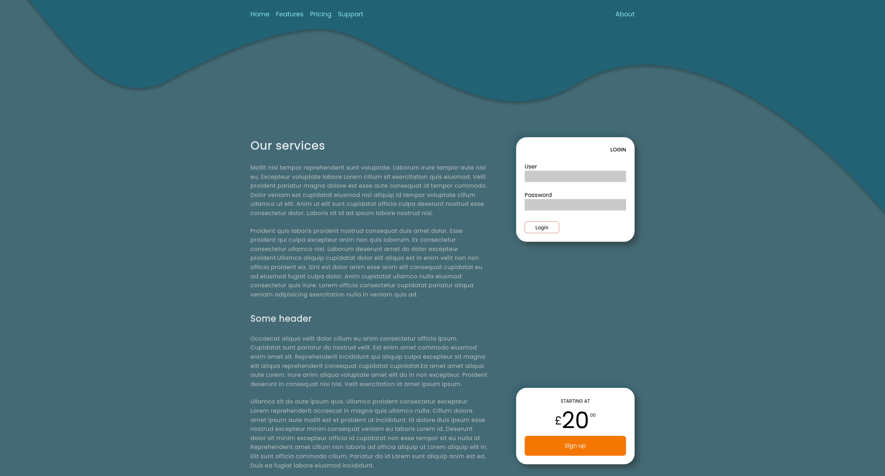
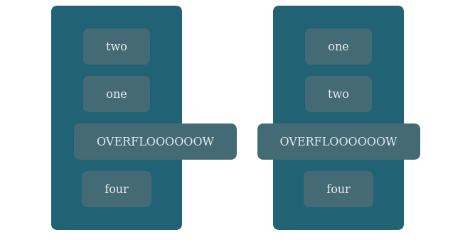

# Getting basics of flexbox
So this is another two column layout. There are a few imperfections to the layout, luckily the focus 
for this exercise was not UI design but learning basics of flexbox :-). 



## A note on CSS versioning.

W3C (world wide web consortium) is handling the specification of the CSS language.
CSS over the years has changed the way they publish changes to specifications. Now days are broken down into modules rather than a single monolithic specification. Each module has its own line of history which is indicated by its level and can in this way be publish changes independently of each other. Higher level has evolved from previous levels by refinement and adding features to it. 

CSS3 is just informal version which doesn't really reflect how specifications versions work these days.

The workgroup publishes a separate document called snapshot intended for software makers to indicate which modules and features are considered stable and should be implemented. 
Feature being mentioned in snapshot are neither any guarantee all such features being correclty implemented or features being frozen.Some parts are in this document may still be at W3C candidate recommendation maturity level.

In addition W3C indicates stability and status of document by using following vocabulary which i briefly try to explain somewhat informally what the mean.
Working draft (WD)
Is used for drafting specifications these are used to get input from public as well as W3C. It's not considered stable and may be incomplete
Candidate Recomendation(CR)
Is used is used by working group to signal that specification is ready for implementation. It's considered complete and know issues have been resolved.
Proposed Recommendation(PR)
All features have been tested comprehensivally ie have a comprehensive testsuite.
"implementation reports proving that every feature is interoperably implemented in at least two shipping implementations. W3C Members are asked to review the specification one last time." 

Recommendation (REC)
    final standard and should not elicit any more changes. But can become obsolete 

Document are often published as a TR which is short for Technical Report.
These are the major ones but there are more if you like to dig deeper.

[The CSS standardization process](https://www.w3.org/Style/2011/CSS-process)

https://www.w3.org/Style/CSS/current-work


W3C also use the term maturity level for it their recomandation track these can be summerized as first public working draft, working draft, candidate recommendation, proposed recommendation, W3C Recomandation and Amended recomadation. [TR= technical report]


## Flex layout
Is a layout mode intended for more complex webpage and application layouts.
To my understanding (from reading the W3C Candidate Recommendation, 19 November 2018)
flex layout was introduced to get a flexible as well as more focused way of laying out content of pages. It circumvents some complexities of floats and columns and
TODO reread the part relating to the text below.
and tries to simplify some common tasks of modern layouts....
 alternative ways of handling content alignment and space distribution, drawing from box alignment module (justify-content, align-items, align-self, align-content). 

The pre-existing layout 

block layout for laying out documents, floats etc
inline layout for text 
table layout 2D tabular
positioned layout. Not part of normal document flow decoupled from other elements of document.

(TODO think this through Some of the older techniques are centered around other concepts such as text or document-centric concepts.)

Flex boxes creates a flex formatting context (basically same as bfc) which contains the effect of the layout within its element.
some block container properties are not applicable in flex layout context
float, clear, vertical-align ,::first-line, ::first-letter 

## Basic concepts
Flexbox is in some sense single dimensioned but can can be nested to create even more complex layouts. What I see people recommend is to use for simple small scaled layout in single direction and use grid instead things becomes more complex and large scale. Flex layout module introduced 12 properties (including shorthands) which is a fair bit of things to keep track of. Below I try to introduce basics to get going and as hopefully not to over complicate things.

### Flex container & its items
Elements declared `display:flex` or `display:inline-flex` are  *flex-containers*. Direct children's of such an element are *flex-items* and layed out according to flex layout box model.

### Directions
Directions in which flex-items are layed out works somewhat differently than other layout modes. Two axis are defined, the primary axis is called the *main axis* and a perpendicular axis called *cross axis*. The main-axis extends from main-start to main-end and cross-axis from cross-start to cross-end. Flex items are layed along the main-axis.
How these map to physical directions are determined by flex-flow and writing mode. 

image goes here

#### Flex-direction property
Will set the direction of main-axis thus determining in which direction flex items are layed out. The direction is also dependent on writing mode. Writing mode is used to support international writing modes. Using english we get the following 

`flex-direction: row`
main axis follows inline axis which in our case would be horizontal axis left to right.
`flex-direction: column`
Same direction as your block axis, in our case the vertical axis top to bottom. 

The reversed directions of the above are also available if you have a need for that. These are the `row-reverse` and `column-reverse` 
#### Wrapping items
FLex-wrap determine if flex container should be layed out in single flex-line or in several flex-lines. If an item  wrap it will be stacked along flex containers cross-axis.
`flex-wrap: no-wrap` 
    single line no wrapping.
`flex-wrap: wrap` 
    wrap onto multiple lines (in cross axis direction)
`flex-wrap: wrap-reverse` 
    wrap onto multiple lines (in cross axis reversed direction swapping the cross-start and cross-end)

#### Direction and wrapping shorthand
Flex-flow is just a shorthand for flex-direction and flex-wrap
default values for this short-hand is code row and nowrap. We could for instance do
```css
flex-flow: column wrap;
```
to set main-axis to column and to allow wrapping.

## Flexible Sizes
Flex items are able to alter their width/height  (to flex) as to fill available space in the main dimension(TODO Have not defined term maybe choose other wording). The flex property controls the sizes along main axis direction. The flex property is shorthand for `flex-grow`, `flex-shrink` and `flex-basis` properties. These can be used as individual properties but the recommendation is use the shorthand. unless `flex-grow`, `flex-shrink` are set to 0 items will fill remaining space. If they are set to 0 items will be fully inflexible. These properties are set on the flex-items them self. 

`flex-grow`
    Specifies a flex grow factor. It determines at what rate item will grow in relation to other items when distributing remaining space. The default value is 1. No negative number are allowed.
`flex-shrink`
Specifies a flex shrink factor. It determines at what rate item will shrink in relation to other items if necessary. This can occur after space has been distributed in situation where sizes become larger then it's flex container. The default is 1.No negative number are allowed.
`flex-basis`
    Specifiec the initial main size  of flex-item, before remaining free space has been distributed. Values can be same as `width` and `height` properties but `auto` and `content` get some special treatment. `auto` uses the `main size`  width and height property to determine base size. `content` set size automatically based on flex item's content, be ware this might not be supported in your browser. 
`none` 
    is equivalent to 0 0 auto. 

flex-basis is first calculated before remaining space is distributed by flex-grow and flex-shrink. We can use auto margins to absorb extra space. This can be useful if we want to push some item(s) in some direction. Spacing is applied after margins and flex-grow values are calculated so item having flex-grow none-zero value or auto margin will grow to fill remaining space thus justify-content will have no effect.  

## Alignment & spacing
Alignment within flex container is applied after flex has finalized it work. That is when sizes have been calculated and space has been distributed among the different items.

Normal margin is applicable is applicable for some alignment tasks (but more powerful).
Box aligment propreties are also respected in flex layouts.

#### Auto margins
While flex bases and flexible length are calculated auto margins are treated as being 0. After sizes have been calculated  auto margins absorb and distribute remaining space.
The consequence of all this is basically that using auto margin or flex-grow will circumvent alignment properties justify-content and align-self as all free space has already been consumed at this point. These will thus in such cases have any effect what so ever.

Another gotcha using auto marigins is tha when boxes  overflows they will ignore auto margins and just overflow its end. The effect of this can be seen in following image


In image on the left auto-margins has been used attempting to center items. On the right the align-self property has been used. As we can see when using margin overflowed items will ignore centering and behave as 

Once content is broken into lines, each line is laid out independently; flexible lengths and the justify-content and align-self properties only consider the items on a single line at a time.

 a single-line flex container, the cross size of the line is the cross size of the flex container, and align-content has no effect. 

[using auto margin](https://www.w3.org/TR/css-flexbox-1/#item-margins)

## Alignment properties
justify-content, align-items, align-content are applied onto flex-container and align-self is applied onto items. Justify-content is applied to main-axis. Align-items and Align-self is applied to cross-axis. these are all single-line alignment properties. There's a seperate property named align-content to handle alignment of multiline content.

### justify content
aligns flexitems along main axis this can take on the values `flex-start`, `flex-end`, `center`, `space-between`, `space-around` and `space-evenly`. The three first just pack all the items at start, center or end along the main axis. The two last distributes the remain spain between the items. The difference between the two being that space-around adds space before first item and after last item whereas space between only adds space between elements. Space-evenly distributes space between items so that there is same amount of space between any two items.

### Align-items
The aligns items works along the cross-axis and is applied to all items in flex-container.It takes the values  `flex-start`, `flex-end`, `center`,  `stretch` and `baseline`. The flex-start, flex-end and center, work in similar fashion as justify-content but along cross-axis.The stretch will stretch item to the cross-end. baseline will align items to axis baselines.

The line upon which most letters "sit" and below which descenders extend.
### Align-self
Align-self overides align-items values per item. It pretty much works as align-items and takes the same values with the addition of `auto`. Auto is the default and hands over cross-axis alignment control to parents align-item value.

### Align-content (multiline alignment)
Aligns container lines within flex container when there is extra space in the cross axis. This property does not work on single content.
This works similar to justify content but in cross-axis direction on wrapped content. Valid values are `flex-start`, `center`, `flex-end`, `space-between`, `space-around`, and `stretch`


[css tricks](https://css-tricks.com/snippets/css/a-guide-to-flexbox/)

[w3c ](https://www.w3.org/TR/css-flexbox-1/)

[MDN web Docs](https://developer.mozilla.org/en-US/docs/Web/CSS/CSS_Flexible_Box_Layout/Basic_Concepts_of_Flexbox)