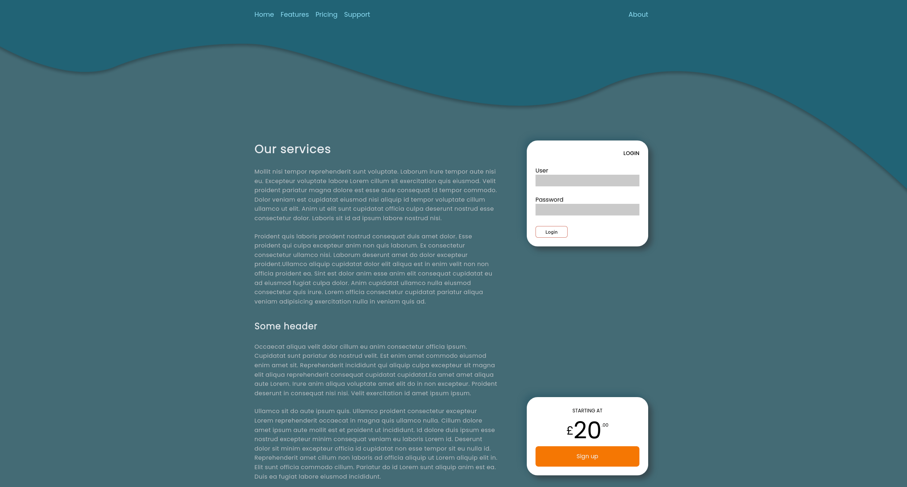

# Getting basics of flexbox
So this is another two column layout. There are a few imperfections to the layout, luckily the focus 
for this exercise was not UI design but learning basics of flexbox :-). 

## Short note on CSS versioning.
W3C (world wide web consortium) are handling the specification the CSS language. It use to be the they published sets of new features and changes under single version number such as CSS 2.0. The last version that used this type of version was versioned as CSS 2.1 (2011). Now a days CSS is broken up in modules which each have their own versions. W3C uses the term level to indicate different version of those modules. For instance a level2 feature has evolved further from level1.  Simply put the higher the level a feature has the further it has evolved. Flex box layout module is a level 1 feature at time of writing. On the web we still sometimes use the informal CSS3 to mean modules of CSS that was introduced after CSS 2.1 in 2011.

## Flex layout
Is a layout mode intended for more complex webpage and application layouts.
To my understanding (from reading the W3C Candidate Recommendation, 19 November 2018)
flex layout was introduced to get a flexible as well as more focused way of laying out content of pages. It rids of complexities of floats and columns and introduces alternative ways of handling content alignment and space distribution drawing from box alignment module (justify-content, align-items, align-self, align-contet) . 

The pre-existing layout 

block layout for laying out documents floats etc
inline layout for text 
table layout 2D tabular
positioned layout. Not part of normal document flow decoupled from other elements of document.

(TODO think this through Some of the older techniques are centered around other concepts such as text or document-centric concepts.)  
## Basic concepts

### Flex container & its items
Elements declared `display:flex` or `display:inline-flex` are  *flex-containers*. Direct children's of such an element are *flex-items* and layed out according to flex layout box model.

### Directions

Directions in which flex-items are layed out works somewhat differently than other layout modes. Two axis are defined the primary axis is called  the *main axis* and a perpendicular axis called *cross axis*. The main-axis extends from main-start to main-end and cross-axis from cross-start to cross-end. Flex items are layed along the main-axis.
The physical direction of these axis can changed to fit your needs.

main axis
main dimensions
cross axis
perpendicular to main axis 

[css tricks](https://css-tricks.com/snippets/css/a-guide-to-flexbox/)
[w3c ](https://www.w3.org/TR/css-flexbox-1/)
