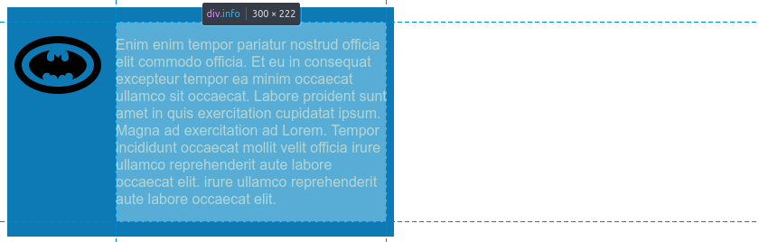

# Basic css exercise 1

The first page is a simple two column page which was built using some good old floats. A screenshot of the resulting page can be seen below. The rest of this document are just a few of the lessons learned why building this page.


## About floats
Floats at its birth where intended for content to flow around objects. Just as in printed media it allows for instance text to flow around images. Developers found that we could exploit this feature to create all kinds of layouts. Flex box and grids are modern approaches to layout but floats are still very much relevant to learn.

### Document flow and floats
Floated objects are removed from normal document flow. As floated objects are not part of the normal document flow they won't add to height of their parent container.In some cases we do want floats objects to add height to their parent container.In those cases a clearfix can be added to the parent container. The basic idee of clearfix is to use the clear property in one or an other way to enforce container to grow beyond the floated elements. For instance we could add div at the end of block with the clear property set to both so for instance 
```html
<div class="container">
    <h1>Comics club</h1>
    <div style= "clear:both"></div>
</div>
```
 Rather than adding an extra div just for this purpose we could for instance add pseudo element using ::after achieving the same effect.

```css
.container::after{
    display:block;
    content:"";
    clear:both;
}
```
Above will add a block level pseudo element  with empty content as last child of container. Another way of achieving a clearfix would be following
```
.clearfix::before,
.clearfix::after,
{
    display:table;
    content:" ";
}
.clearfix::after{
    clear:both;
}
```
Above version will create a
add a table element at top and bottom of its container. This works because
an implicit table-row will be created within the table. Margins don't collapse through table rows (as they create block formatting context. ???)

### Float catching
Float catching occurs when a first element is higher than a second element. if we float a third element which normally would overflow to the second line it would instead be aligned to the right caught on the edge lower edge of the first.  


The cure for this is using clear. For instance in this case we could clear odd element on it's left hand side.

```css
  .box:nth-child(odd){
    clear:left;
  }
```

### Collapsed margins
Top and/or bottom margins will sometimes collapse. By collapsing margin we mean that two or more margins will be combined to create single margin. The size of such a margin is always the size of the largest margin among the combined margins. Margins between adjacent sibling collapse in most cases. Let's look at a simple scenario.
 
 ```html
 <div class="container">
      <div class="box-one"></div>
      <div class="box-two"></div>
      <div class="box-three"></div>
</div>
 ```
Nothing strange here, just a double container  which lets us center the three boxes inside it. And the css

 ```css
 .container {
  margin: 100px auto;
  background: rgba(176, 213, 233, 0.5);
  width: 80vw;
  box-shadow: 0 0 20px 0 rgba(0, 0, 0, 0.5);
}
.one {
  height: 50px;
  background: #db6901;
}
.two {
  height: 50px;
  background: #0d7ab5;
}
.three {
  height: 50px;
  background: #00466b;
}
  ```
Will give us the following layout. 

lets add a bottom-margin of 100px to box-one.
```css
.one {
  height: 50px;
  background: #db6901;
  margin-bottom:100px;
}
```

And we get the following result.


Nice!  how about adding top-margin of 50px to box-two.
```css
.two {
  height: 50px;
  background: #0d7ab5;
  margin-top: 50px;
}
```
Nothing seems to happen. So we try to add some more top margin maybe 80px but still no change until we hit values large than 100px. If inspect margins in dev-tools box-one and box-two we can see what's really going on here. First box-one


 So box-one margin seems to take upp the full bottom margin below it's box. This margin should be 100px. Now let's take a look at top margin of box-two. 


Hmm it's seems to be half the size of the top margin but it also seems as if it's overlapping with bottom margin of box-one. So this is what border collapsing is. The margins of adjacent siblings with adjoining margins will form single margin in this case and the size of the margin will be the largest of the adjoining margins (think adjacent sibling combiner div + div ).

Lets try another scenario. Lets attempt add top margin of 200px to box-one. box-one is inside container so we might expect to see a 200px height lightblue area with box shadow surrounding it.   What really happens is that the three boxes just moved down by 100px. No background in sight. Inspecting box-one again with dev-tools we see following. 


So the margin seems to have moved outside of box-one. What's happening here is that top margin of container and top margin of box-one has collapsed and is actually placed on the outside of container. Inspecting container margin will show that it's top margin is only half of the resulting collapsed margin. 


In this case the a descendants top margin collapsed with the parents top margin. This will if happen if there is no content separating the two. The conditions in which this happens is described in the [MDN web docs.]([https://link](https://developer.mozilla.org/en-US/docs/Web/CSS/CSS_Box_Model/Mastering_margin_collapsing)).

>  If there is no border, padding, inline part, block formatting context created, or clearance to separate the margin-top of a block from the margin-top of one or more of its descendant blocks; or no border, padding, inline content, height, min-height, or max-height to separate the margin-bottom of a block from the margin-bottom of one or more of its descendant blocks, then those margins collapse. The collapsed margin ends up outside the parent.
> 
Note collapsed margin will be placed outside the parent. 

Some of the collapsing behavior that occur on your pages often goes unnoticed and in fact can simplify life. For instance user agents normally add some margins to headers and paragraphs. Headers get more margins than paragraph. If no there were no collapsing between a header and paragraphs then the margin between header and paragraph would be added up and would render a greater margin between header and paragraph than margin above header. But sometimes if we are not aware of these thing we could end up with mysterious unexpected behavior. Lets look at a yet another simple scenario.
 ```html 
 <div class="header">
      <h1>Collapsing margins strangeness</h1>
    </div>
      <div class="main">
        <h2>Why and how does things collapse</h2>
        <p>Why do we get a margin between the header and this box????</p>
      </div>
    </div>
 ```
 
 ```css
 header {
  color: #fff;
  background: #00466b;
  border-radius: 0.5em;
}
.main {
  background: rgba(176, 213, 233, 0.5);
  border-radius: 0.5em;
  overflow: auto;
} 
 ```
 And the screenshot where i inspect the h2.
 
 
 
Several questions arise. Why does h2 get user agent margin and h1 seems to get none and where does the gap between the two blocks come from? This is of course again due to margin collapsing. See even thou we haven't added any margins user agent has added some for us. The margins here are 1em (16px) for paragraphs,0,8032em (19.92px) for h2 and 0.67em (21.44px) for h1. Here the h1:s bottom-margin and divs bottom margin will collapse outside the parent that is the div. This is what is causing the gap and why h1 has no default margin around it in the header. 


But what about the h2? Well inside the main block we have the overflow:auto which will create a Block Formatting Context (BFC) preventing that box from collapsing with its surrounding blocks. 

Note that this kind of effect can be caused by elements deeply nested in your hierarchy which can make it hard at first to spot what is causing it.

### Preventing margin-collapse
There are several ways of preventing margins from collapsing depending on situation. Things like border and padding will often prevent margin from collapsing. If we try to add a padding of 1em to header in the last example we will get the following result. 


No more gap between header and main box. One strategy to avoid surprises caused by user user agent set margins is to simply reset all margins to 0. This of course makes you responsible of setting all your margins by hand. When doing so it could be a good idea to always stick to only set bottom margins. This way you minimize risk running into to surprising margin collapses.


### BFC to prevent wrapping around objects.
Following short description of block formatting context can be found at [MDN documentation pages](https://developer.mozilla.org/en-US/docs/Web/Guide/CSS/Block_formatting_context)

> A block formatting context is a part of a visual CSS rendering of a web page. It's the region in which the layout of block boxes occurs and in which floats interact with other elements.


BFC:s are created in a number of situations some of which are listed at [MDN pages](https://developer.mozilla.org/en-US/docs/Web/Guide/CSS/Block_formatting_context).

So what a bfc does is for us is to isolate some region of you page. Doing so it it creates an imaginary border between what inside that region and whats on the outside. The isolation achieves three things in particular. 

- contain internal floats
- exclude external floats
- suppress collapsing

So float within a BFC wont interact or overlap with content on outside rather it will float only within the region defined by BFC. All floating behavior will occur inside the BFC. The other way around is also true. That is if something outside the bfc is floated it wont effect what happens inside BFC.In The last bullets says that margins within BFC wont collapse with margins outside a BFC. Lets witness the effect of BFC first hand by looking at a media box.
```css
<div class="card">
      
      <div class="card__info">
        <p>
          Enim enim ...
      </div>
    </div>
```
This is a simple media box. we style it with some simple css

```css
.card {
  float: left;
  width: 50%;
  padding: 1em 0.5em;
  background: #0d7ab5;
  color: wheat;
}
.card__image {
  float: left;
 padding-right: 1em;
}

```
nothing really out of the ordinary just some sizing, padding, colors and then we float both boxes. Inspecting the card__info box we find that it's spans the image as well this and the text will flow around the image.


If we want the info__box NOT to flow around the image but rather sit to the right of it all all the way to the bottom of box we can add a card__info box to create it's own BFC. 
In this case lets use following rule.
```css
.card__info{
  display:flow-root;
}
```
A block formatting context is created in a number of situations. For instance we could had used `css overflow:auto`. But since our intention in this scenario was explicitly to create a BFC it feels only appropriate to use `css display:flow-root;` as it's intended for establishing BFC or a formatting root see [display docs](https://developer.mozilla.org/en-US/docs/Web/CSS/display). This also avoid any side effects that other methods might incur. So if we inspect the `css .card__info` now we se that it has got it's own block for its layout.



### Lobotomized owl selector * + *

This pattern selects any element followed by any adjacent element. This would select any element that is not first child of its parents. This could for instance be used to set some default top margin throughout your page or by combining with some other selector within some specific area of you page. 
```css
.main * + *{
  margin-top: 1.5em;
}

```
In some cases this will work for the most part but don't worry we can always override those cases where it does not work. Note if we would like to set top margin for whole page we need to select body first. `body *.* :{margin...` as body is adjacent sibling of head.


<!-- TODO experiment with display table to make column equal height also try out flexbox for the same affect -->

